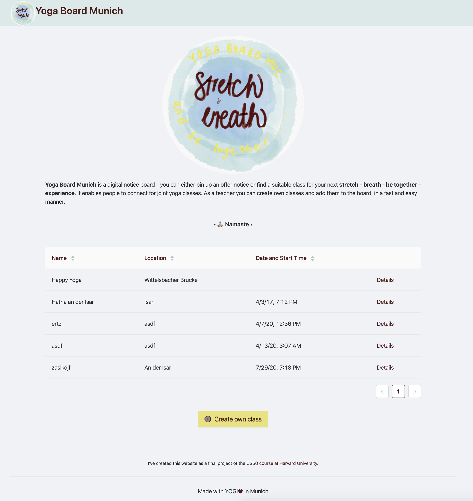

<!-- PROJECT LOGO -->
<br />
<p align="center">
  <a href="https://github.com/lschlesinger/CS50-yoga-board-munich">
    
  </a>

  <h3 align="center">YOGA Board Munich</h3>

  <p align="center">
    This is a CS50 final project.
    <br />
    <a href="https://github.com/github_username/repo">View Demo</a>
  </p>
</p>


<!-- TABLE OF CONTENTS -->
## Table of Contents

* [About the Project](#about-the-project)
  * [Built With](#built-with)
* [Getting Started](#getting-started)
  * [Prerequisites](#prerequisites)
  * [Installation](#installation)
* [License](#license)


<!-- ABOUT THE PROJECT -->
## About the Project
I've created this website as a final project of the [CS50
course at Harvard University](https://cs50.harvard.edu/).
My motivation was to create a digital notice board to easily connect people from Munich for practicing yoga together.
I am a yoga teacher my own and despite of offering classes on a regular base in studios, one might check out the opportunity to simply start sessions rather spontanously at a different places open for everybody interessted. 
That's why I came up with the idea of Yoga Board Munich.
You can either pin up an offer notice or find a suitable class for your next stretch - breath - be together - experience.
As a teacher you can create classes with basic information and add them to the board in just a few clicks.

So don't hesitate:
[Check out the MUNICH YOGA BOARD](https://yoga-board.herokuapp.com/)



### Built With

* [Spring Boot]()
* [Angular]()
* [PostgreSQL]()
* [Heroku]()
* [Docker]()


<!-- GETTING STARTED -->
## Getting Started

To get a local copy up and running follow these simple steps.

### Prerequisites

This is an example of how to list things you need to use the software and how to install them.
* npm
```sh
npm install npm@latest -g
```
* maven
```sh
brew install maven
```
* java
```sh
brew cask install java
```
* angular cli
```sh
npm install -g @angular/cli
```
* [docker](https://docs.docker.com/docker-for-mac/install/)


### Installation
 
1. Clone the repo
```sh
git clone git@github.com:lschlesinger/CS50-yoga-board-munich.git
```
2. Install NPM packages
```sh
cd frontend
npm install
```

### Run
1. Start database, e.g. with docker
```sh
docker-compose -f docker-compose.dev.yml up
```
2. Start backend (can also be done from IDE), will run on port `8080`
```sh
./mvnw spring-boot:run
```
3. Start frontend (with proxy to backend), will run on port `4200`
```sh
cd frontend
npm start
```

<!-- LICENSE -->
## License

Distributed under the MIT License. See `LICENSE` for more information.
